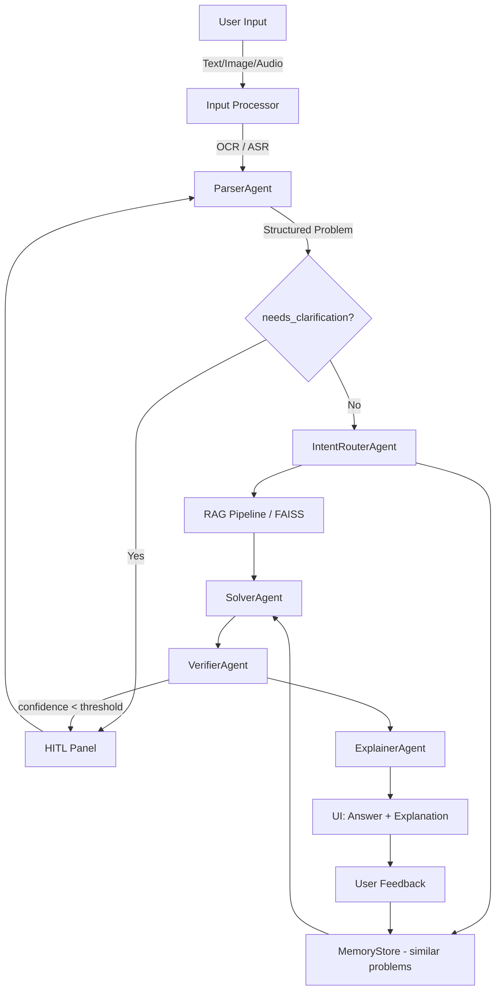

# 🧮 Math Mentor — JEE AI Tutor

An end-to-end multimodal math problem-solving application with RAG, multi-agent system, HITL, and memory.

---

## Architecture



---

## File Structure

```
math_mentor/
├── app.py                    # Streamlit UI (main entry point)
├── orchestrator.py           # Ties all agents together
├── config.py                 # Configuration from .env
├── requirements.txt
├── .env.example
├── agents/
│   ├── parser_agent.py       # Cleans OCR/ASR → structured JSON
│   ├── router_agent.py       # Classifies problem, plans strategy
│   ├── solver_agent.py       # Solves using RAG + SymPy + LLM
│   ├── verifier_agent.py     # Checks correctness, triggers HITL
│   └── explainer_agent.py    # Student-friendly explanation
├── rag/
│   └── pipeline.py           # Chunk → Embed → FAISS → Retrieve
├── memory/
│   └── store.py              # JSON-based memory with similarity search
├── utils/
│   ├── ocr.py                # Tesseract + EasyOCR
│   ├── audio.py              # Whisper (local + OpenAI API)
│   └── llm.py                # OpenAI client wrapper
└── knowledge_base/
    ├── algebra.txt
    ├── calculus.txt
    ├── probability.txt
    ├── linear_algebra.txt
    └── solution_templates.txt
```

---

## Setup

### 1. Clone and install

```bash
git clone <repo-url>
cd math_mentor
python -m venv venv
source venv/bin/activate   # Windows: venv\Scripts\activate
pip install -r requirements.txt
```

### 2. System dependencies

```bash
# Ubuntu/Debian
sudo apt-get install tesseract-ocr

# macOS
brew install tesseract
```

### 3. Configure environment

```bash
cp .env.example .env
# Edit .env and add your OPENAI_API_KEY
```

### 4. Run the app

```bash
streamlit run app.py
```

The app opens at `http://localhost:8501`

---

## Deployment (Streamlit Cloud)

1. Push repo to GitHub
2. Go to [share.streamlit.io](https://share.streamlit.io)
3. New app → select repo → `app.py`
4. Add secrets: `OPENAI_API_KEY = "sk-..."`
5. Deploy

---

## Agents

| Agent | Role |
|-------|------|
| **ParserAgent** | Cleans raw OCR/ASR/text → structured JSON with topic, variables, constraints |
| **IntentRouterAgent** | Classifies problem type, plans solution strategy |
| **SolverAgent** | Solves using RAG context + SymPy + GPT-4o |
| **VerifierAgent** | Checks correctness, domain, edge cases, triggers HITL if unsure |
| **ExplainerAgent** | Student-friendly step-by-step explanation |

## HITL Triggers

- OCR confidence < 0.6
- ASR confidence < 0.7
- Parser detects ambiguity (`needs_clarification: true`)
- Verifier confidence < 0.75
- User explicitly requests re-check

## Memory

All solved problems stored in `memory/memory.json` with:
- Original input, parsed question, retrieved context
- Final answer, explanation, verifier outcome
- User feedback (correct/incorrect + comment)

At runtime: similar problems retrieved by Jaccard similarity + topic matching to assist the solver.

---

## Demo Topics

- `Find the roots of x^2 - 5x + 6 = 0`
- `A bag has 3 red and 4 blue balls. Find P(red | 2 draws without replacement)`
- `Find lim_{x→0} sin(3x)/x`
- `Find the maximum value of f(x) = -x^2 + 4x + 1`
- `Find the determinant of [[1,2],[3,4]]`